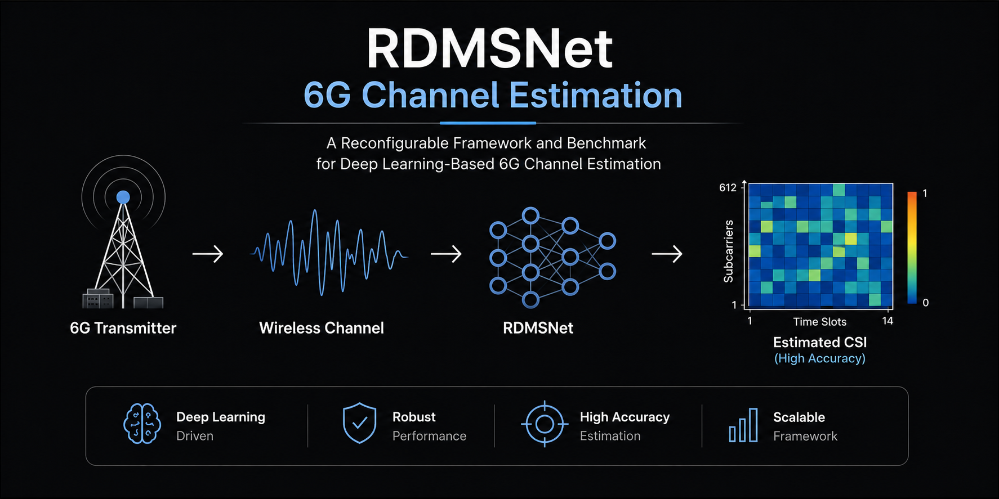
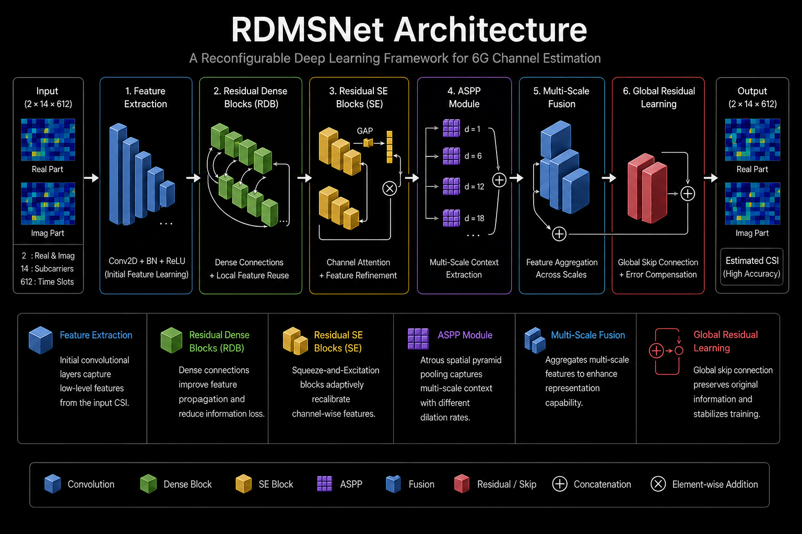
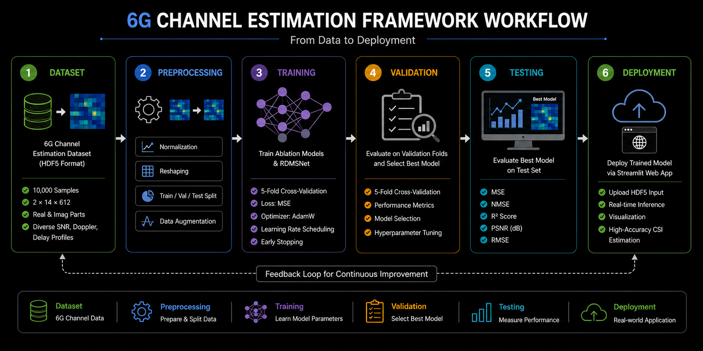
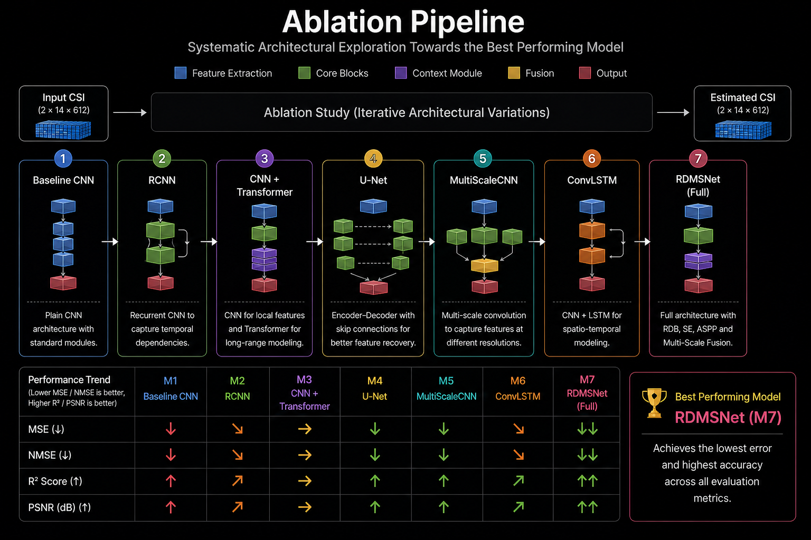
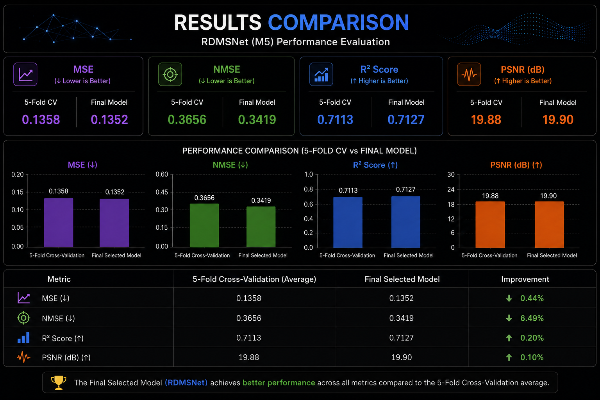
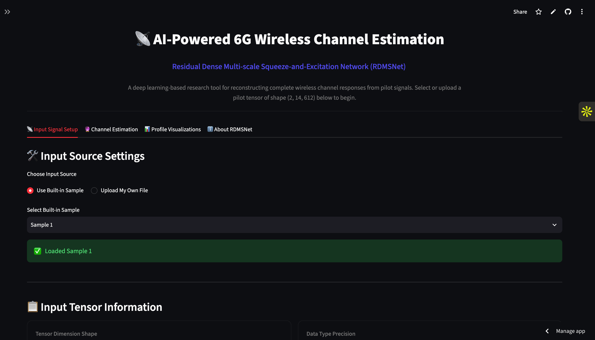
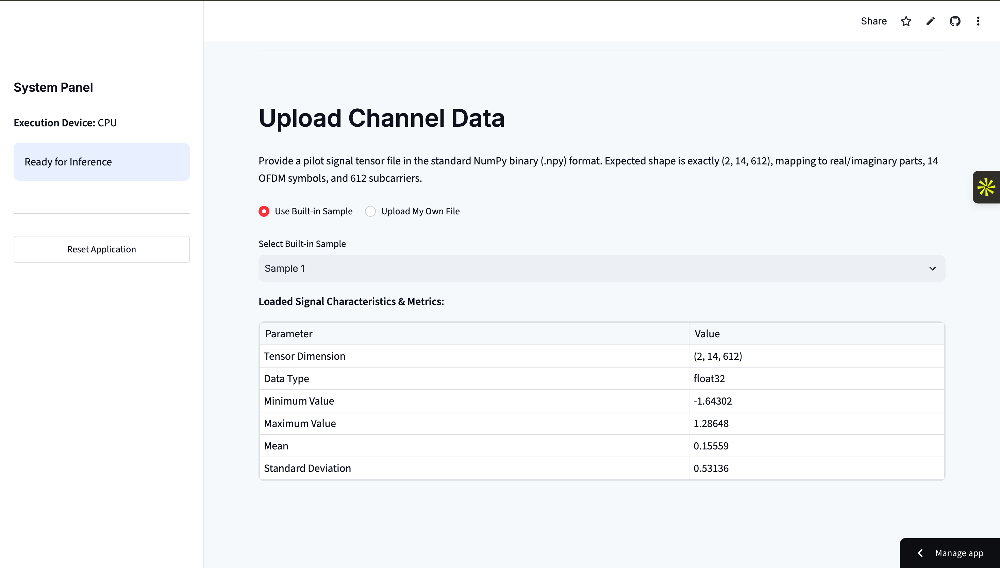
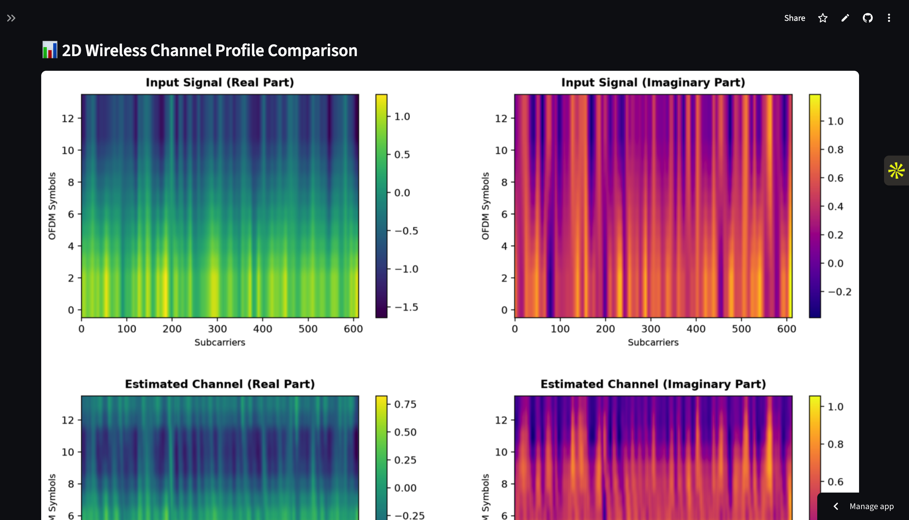
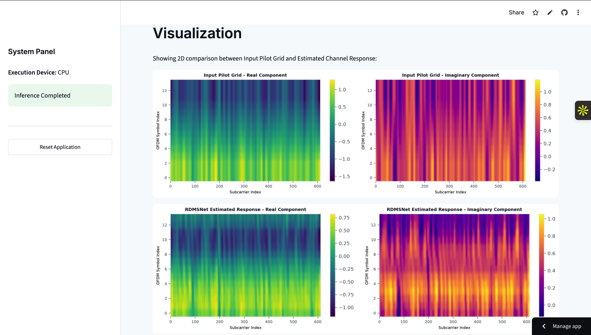

# 📡 A Reconfigurable Framework and Benchmark for Deep Learning-Based 6G Channel Estimation

<p align="center">
  
</p>

<div align="center">

<p align="center">


</p>

### 🚀 Deep Learning Framework for 6G Wireless Channel Estimation

An end-to-end deep learning framework for accurate 6G channel estimation using **RDMSNet**, complete benchmarking, and an interactive Streamlit web application.

🌐 **Live Demo:** https://6g-channel-estimation.streamlit.app

<br>

<div align="center">

| 🚀 Framework | 🤖 Models | 📊 Validation | 🌐 Deployment |
|:-----------:|:---------:|:-------------:|:-------------:|
| **RDMSNet** | **7 Deep Learning Models** | **5-Fold Cross Validation** | **Streamlit Web App** |

</div>

---


</div>

---

## 📑 Table of Contents

- [Overview](#-overview)
- [Problem Statement](#-problem-statement)
- [Motivation](#-motivation)
- [Features](#-features)
- [Framework Architecture](#-framework-architecture)
- [Dataset](#-dataset)
- [Benchmark Models](#-benchmark-models)
- [Results](#-results)
- [Web Application](#-web-application)
- [Installation](#-installation)
- [Usage](#-usage)
- [Project Structure](#-project-structure)
- [Technologies Used](#-technologies-used)
- [Future Work](#-future-work)
- [Author](#-author)

---

# 📖 Overview

Accurate **Channel State Information (CSI)** is one of the fundamental requirements for reliable and high-speed communication in next-generation **6G wireless networks**. As wireless environments become increasingly dynamic due to high mobility, multipath propagation, Doppler effects, and complex channel conditions, conventional channel estimation techniques often struggle to maintain both estimation accuracy and computational efficiency.

This project presents a **reconfigurable deep learning framework** designed for benchmarking and evaluating multiple neural network architectures for 6G channel estimation. The framework provides a unified experimental environment that enables fair comparison of different models using standardized datasets, identical training strategies, and common evaluation metrics.

The primary contribution of this work is **RDMSNet (Residual Dense Multi-Scale Network)**, a lightweight yet powerful architecture that integrates Residual Dense Blocks, Squeeze-and-Excitation (SE) Attention, Atrous Spatial Pyramid Pooling (ASPP), and Multi-Scale Feature Fusion to effectively capture complex wireless channel characteristics.

To ensure reliable performance evaluation, the framework incorporates **5-Fold Cross Validation** and reports multiple evaluation metrics including **NMSE, RMSE, MSE, PSNR, and R² Score**. Additionally, an interactive **Streamlit Web Application** is provided for real-time inference, making the framework useful for both research and practical demonstrations.

---

# 🎯 Problem Statement

Future **6G wireless communication systems** demand highly accurate and efficient channel estimation to support ultra-high data rates, ultra-low latency, massive connectivity, and intelligent communication services. However, accurately estimating wireless channels remains a significant challenge due to rapidly varying propagation environments, severe multipath fading, Doppler shifts, noise, and increasing system complexity.

Conventional channel estimation techniques, such as **Least Squares (LS)** and **Minimum Mean Square Error (MMSE)**, often suffer from limited estimation accuracy under highly dynamic channel conditions and may require significant computational resources or prior statistical information. These limitations make them less suitable for next-generation wireless networks.

Although recent deep learning-based approaches have shown promising improvements, many existing models focus on a single architecture and lack a unified framework for systematic comparison, benchmarking, and reproducible experimentation.

This project addresses these challenges by developing a **reconfigurable deep learning framework** capable of benchmarking multiple architectures under identical experimental conditions while proposing **RDMSNet**, an optimized model designed to improve channel estimation accuracy and robustness for 6G communication systems.

---

# 💡 Motivation

The rapid evolution of wireless communication technologies has created a growing demand for intelligent and adaptive channel estimation techniques. As 6G networks aim to support applications such as autonomous vehicles, holographic communication, extended reality (XR), and massive Internet of Things (IoT), traditional estimation methods become increasingly inadequate due to their limited ability to model complex and nonlinear wireless channels.

The motivation behind this project is to build a **flexible, modular, and research-oriented framework** that enables fair comparison of multiple deep learning architectures under a unified experimental setup. Rather than evaluating a single model, this framework allows researchers to benchmark different approaches using the same dataset, preprocessing pipeline, training strategy, and evaluation metrics.

Furthermore, this work introduces **RDMSNet**, a lightweight architecture designed to improve estimation accuracy while maintaining computational efficiency. The framework is intended to accelerate research, simplify experimentation, and provide a solid baseline for future deep learning-based 6G channel estimation studies.

---

# ✨ Features

This framework is designed to provide a complete research and benchmarking environment for **Deep Learning-Based 6G Channel Estimation**.

<table>
<tr>
<td width="50%">

### 🧠 Deep Learning Models
- RDMSNet (Proposed)
- CNN Baseline
- RCNN
- U-Net
- Attention-Based Models
- Multi-Scale CNN
- Benchmark Architecture Support

</td>

<td width="50%">

### 📊 Performance Evaluation
- 5-Fold Cross Validation
- NMSE
- RMSE
- MSE
- PSNR
- R² Score

</td>
</tr>

<tr>
<td>

### ⚙️ Framework
- Modular Code Structure
- Easy Model Training
- Easy Testing
- Benchmark Pipeline
- Reconfigurable Architecture

</td>

<td>

### 🌐 Deployment
- Streamlit Web Application
- Interactive Prediction
- GPU Support (PyTorch)
- HDF5 Dataset Support
- Research Friendly

</td>
</tr>
</table>

---

# 🏗️ Framework Architecture

The proposed framework follows a modular deep learning pipeline designed specifically for **6G channel estimation**. Each stage is independently configurable, allowing researchers to benchmark multiple architectures while maintaining a consistent training and evaluation pipeline.

<p align="center">


<p align="center">
  
</p>

</p>

## 🔄 Workflow

```text
Input CSI
     │
     ▼
Data Preprocessing
     │
     ▼
Feature Extraction
     │
     ▼
Residual Dense Learning
     │
     ▼
SE Attention
     │
     ▼
ASPP Module
     │
     ▼
Multi-Scale Feature Fusion
     │
     ▼
Channel Reconstruction
     │
     ▼
Performance Evaluation
```

## 🧩 Key Components

| Component | Purpose |
|-----------|---------|
| **Input Layer** | Receives complex-valued CSI data from the dataset. |
| **Feature Extraction** | Learns low-level spatial representations from wireless channels. |
| **Residual Dense Blocks** | Improves feature reuse and gradient propagation. |
| **SE Attention Module** | Enhances informative channel features while suppressing irrelevant information. |
| **ASPP Module** | Captures multi-scale contextual information using different dilation rates. |
| **Multi-Scale Fusion** | Combines features extracted at different receptive fields. |
| **Output Layer** | Reconstructs the estimated wireless channel. |

<p align="center">
  
</p>

---

# 📂 Dataset

The framework is trained and evaluated using a **synthetically generated 6G Channel Estimation dataset** stored in **HDF5 (.h5)** format. The dataset contains diverse wireless channel conditions to simulate realistic communication environments and enable fair benchmarking of deep learning models.

## 📊 Dataset Overview

| Property | Value |
|----------|-------|
| Dataset Format | HDF5 (.h5) |
| Total Samples | 10,000 |
| Input Shape | (2, 14, 612) |
| Output Shape | (2, 14, 612) |
| Data Type | float32 |
| Carrier Frequency | 7 GHz |
| MIMO Configuration | 1 × 1 |
| SNR Range | -10 dB to 30 dB |
| Doppler Range | 5 Hz – 5000 Hz |
| Speed Range | 1 – 120 m/s |

---

## 📁 Dataset Structure

```text
6G_ChanEst_Dataset_10k_Samples.h5
│
├── X_input
├── Y_label
├── logs
│   ├── snrLog_dB
│   ├── dopplerLog_Hz
│   ├── delaySpreadLog_s
│   ├── speedLog_mps
│   └── ...
└── meta
    ├── cfg_json
    └── datasetMeta_json
```

---

## 📥 Input Tensor

The input tensor consists of **complex-valued Channel State Information (CSI)** represented using two channels:

| Channel | Description |
|---------|-------------|
| Channel 0 | Real Part |
| Channel 1 | Imaginary Part |

Tensor Shape:

```text
(2, 14, 612)
```

where:

- **2** → Real & Imaginary Channels
- **14** → OFDM Symbols
- **612** → Active Subcarriers

---

## 🎯 Target Tensor

The target tensor has the same dimensionality as the input and represents the corresponding ground-truth channel used during supervised learning.

```text
Target Shape = (2, 14, 612)
```

---

## 🌍 Channel Diversity

The dataset includes a wide range of wireless propagation conditions, including:

- Multipath Fading
- Doppler Shift
- Delay Spread
- Variable Signal-to-Noise Ratios (SNR)
- Different User Speeds
- Multiple Channel Profiles

These variations help evaluate the robustness and generalization capability of different deep learning architectures.

---

# 🤖 Benchmark Models

To systematically evaluate the contribution of each architectural component, an **ablation study** was performed. Starting from a simple convolutional baseline, new modules were progressively introduced to analyze their impact on channel estimation performance.

This incremental design strategy provides a fair comparison and demonstrates how each component contributes to the overall performance of the proposed framework.

## 📊 Ablation Study

| Model | Architecture | Newly Added Component |
| :---: | ------------ | --------------------- |
| **M1** | Baseline Convolutional Network | Baseline Model |
| **M2** | M1 + Residual Dense Blocks | Residual Dense Feature Learning |
| **M3** | M2 + Residual SE Blocks | Channel Attention (SE) |
| **M4** | M3 + ASPP Module | Multi-Scale Context Extraction |
| ⭐ **M5 (Proposed RDMSNet)** | M4 + Multi-Scale Fusion + Global Residual Learning | Final Proposed Architecture |

---

## 🏗️ Progressive Model Evolution

```text
M1
Baseline CNN
      │
      ▼
M2
+ Residual Dense Blocks
      │
      ▼
M3
+ Residual SE Blocks
      │
      ▼
M4
+ ASPP Module
      │
      ▼
⭐ M5 (RDMSNet)
+ Multi-Scale Fusion
+ Global Residual Learning
```

<p align="center">
  
</p>

---

## 🎯 Purpose of the Ablation Study

The objective of the ablation study is to evaluate the individual contribution of each architectural enhancement toward improving channel estimation performance.

Each model was trained using:

- ✅ Same Dataset
- ✅ Same Data Preprocessing
- ✅ Same Training Strategy
- ✅ Same Hyperparameters
- ✅ Same 5-Fold Cross Validation Protocol
- ✅ Same Evaluation Metrics (NMSE, RMSE, MSE, PSNR, and R²)

This controlled experimental setup ensures that any improvement in performance is solely due to the newly introduced architectural component.

---

# 📊 Results

The proposed **RDMSNet (M5)** was evaluated using both **5-Fold Cross-Validation** and the **Final Selected Model**. Performance was assessed using standard regression metrics to measure channel estimation accuracy and reconstruction quality.

## 📈 Performance Summary

| Metric | 5-Fold Cross-Validation | Final Selected Model |
|:-------|:-----------------------:|:--------------------:|
| **MSE ↓** | **0.1358** | **0.1352** |
| **NMSE ↓** | **0.3656** | **0.3419** |
| **R² Score ↑** | **0.7113** | **0.7127** |
| **PSNR (dB) ↑** | **19.88** | **19.90** |

> **Note:** Lower values are better for **MSE** and **NMSE**, while higher values are better for **R² Score** and **PSNR**.

<p align="center">
  
</p>

---

## 🏆 Key Observations

- ✅ The proposed **RDMSNet (M5)** achieved the best overall performance among all ablation models.
- ✅ The final selected model reduced **NMSE** from **0.3656** to **0.3419**, demonstrating improved channel estimation accuracy.
- ✅ The **R² Score** increased from **0.7113** to **0.7127**, indicating a stronger agreement between the predicted and ground-truth channels.
- ✅ The final model achieved a **PSNR of 19.90 dB**, reflecting high-quality channel reconstruction.
- ✅ Consistent performance across **5-Fold Cross-Validation** demonstrates the robustness and generalization capability of the proposed architecture.

---

## 📌 Evaluation Metrics

| Metric | Description |
|---------|-------------|
| **MSE** | Measures the average squared error between the predicted and ground-truth channel. Lower values indicate better performance. |
| **NMSE** | Measures normalized reconstruction error, making comparisons independent of signal power. Lower values are better. |
| **R² Score** | Indicates how well the predicted channel matches the actual channel. Values closer to **1** represent better prediction accuracy. |
| **PSNR** | Measures reconstruction quality in decibels (dB). Higher values indicate better signal reconstruction quality. |

---

# 🌐 Web Application

The project includes an interactive **Streamlit-based web application** that enables users to perform real-time **6G channel estimation** using the proposed **RDMSNet** model. The application provides an intuitive interface for uploading channel data, running inference, and visualizing the estimated channel.

## ✨ Key Features

- 📂 Upload HDF5 (.h5) channel data
- 🧠 Inference using the trained RDMSNet model
- ⚡ Fast and interactive predictions
- 📊 Visualization of estimated channel outputs
- 💻 Clean and user-friendly interface

---

## 📸 Application Screenshots

### 🏠 Application Interface

<p align="center">
  
  
</p>

<p align="center">
  
  
</p>

---

> **Live Demo:** *https://6g-channel-estimation.streamlit.app*

---

# ⚙️ Installation

Follow the steps below to set up the project on your local machine.

## 1. Clone the Repository

```bash
git clone https://github.com/vishal-49/6G-Channel-Estimation.git
```

---

## 2. Navigate to the Project Directory

```bash
cd 6G-Channel-Estimation
```

---

## 3. (Optional) Create a Virtual Environment

### Windows

```bash
python -m venv venv
venv\Scripts\activate
```

### macOS / Linux

```bash
python3 -m venv venv
source venv/bin/activate
```

---

## 4. Install Required Dependencies

```bash
pip install -r requirements.txt
```

---

## 5. Launch the Streamlit Application

```bash
streamlit run app.py
```

The application will automatically open in your default browser.

---

# 🚀 Usage

After launching the Streamlit application, follow these steps:

1. Open the web interface.
2. Upload a sample **HDF5 (.h5)** channel input.
3. Click **Estimate Channel**.
4. The trained **RDMSNet** model performs inference.
5. View the predicted channel estimation results.

---

## 📂 Sample Inputs

Example input files are available inside the **samples/** directory for quick testing.

---

## 🧠 Model Files

The trained model and architecture are stored inside the **model/** directory and are automatically loaded by the application during inference.

---

# 📁 Project Structure

```text
6G-Channel-Estimation/
│
├── model/                  # Trained model files
├── samples/                # Sample input files
├── assets/                 # Images used in README
│
├── app.py                  # Streamlit web application
├── app_v2.py               # Alternative application version
├── deployment_model.py     # Model loading & inference
├── utils.py                # Utility functions
├── requirements.txt        # Project dependencies
├── README.md               # Project documentation
│
└── __pycache__/            # Python cache files
```

---

# 🛠️ Technologies Used

| Category | Technology |
|----------|------------|
| Programming Language | Python |
| Deep Learning | PyTorch |
| Web Framework | Streamlit |
| Dataset Format | HDF5 |
| Numerical Computing | NumPy |
| Visualization | Matplotlib |
| Version Control | Git & GitHub |

---

# 🔮 Future Work

The proposed framework can be further extended in several directions:

- 🚀 Support for Massive MIMO systems
- 📡 Integration with RIS-assisted communication
- 🤖 Transformer-based channel estimation models
- ⚡ Real-time edge deployment
- 📊 Larger benchmark datasets
- ☁️ Cloud-based inference and deployment

---

# 👨‍💻 Author

<div align="center">

## Vishal Singh

**Bachelor in Technology from National Institute of Technology, Agartala**

Passionate about **Artificial Intelligence, Deep Learning, Computer Vision, and Next-Generation Wireless Communication Systems.**

<p>

<a href="https://github.com/vishal-49">

</a>

<a href="(https://www.linkedin.com/in/vishal-singh-74009b38a)">

</a>

</p>

⭐ If you found this project helpful, consider giving it a star.

</div>

